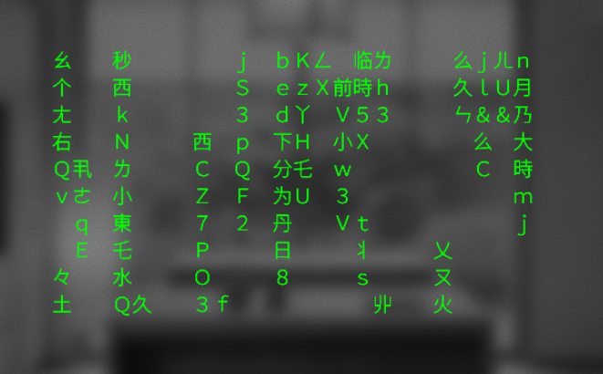

# eventrix
Most useless app on EvenHub, but it would be wrong not to make it for this display.



### fun and discoveries
Figured out how to draw monospace ascii and other unicode characters, check [utils.ts](./src/utils/utils.ts) for function and [consts.ts](./src/utils/consts.ts) for set of characters

### dev

add simulator to bin to be able to run `sim`
```shell
cd node_modules/.bin
ln -s ../@evenrealities/sim-linux-x64/bin/evenhub-simulator .
```
